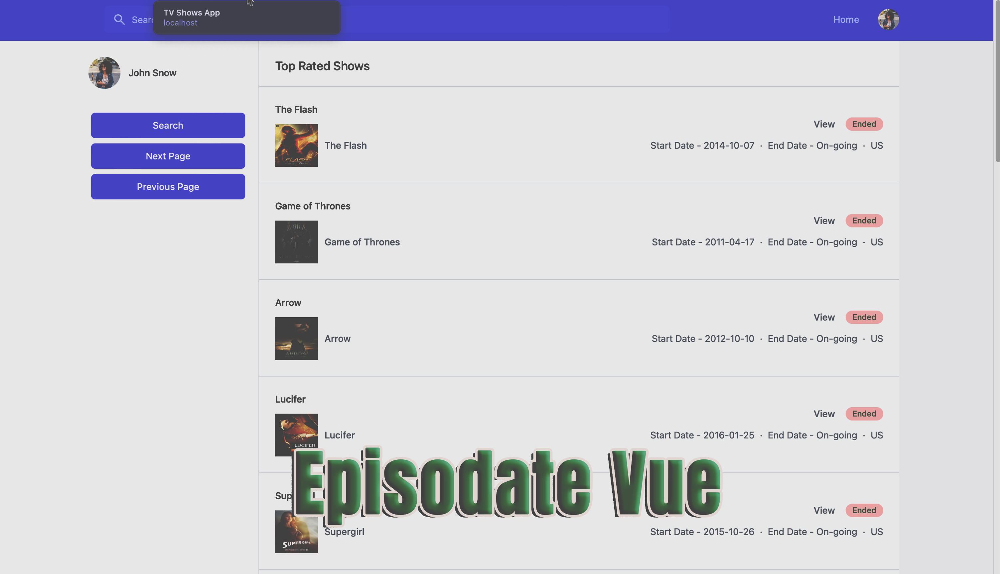
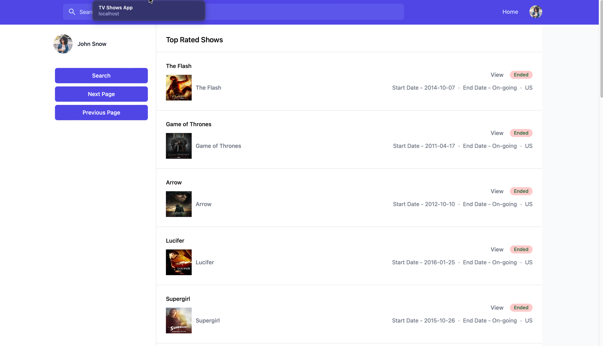

# Vue Episodite

This is a simple web application in Vue 3 which makes use of API from Episodate.com to display TV shows related data. This app can be used to search for TV shows and see the details of the show.

[Episodate API]([https://link-url-here.org](https://www.episodate.com/api))

I was searching for open APIs which provide limited number of requests for free with useful data. I stumbled across this and thought of turning this into a Vue 3 mini-project. This project also uses dynamic components from Headless UI and is completely responsive ie mobile friendly.

## Technologies Used

- Vue 3
- Tailwind CSS
- Vite
- Headless UI (For dynamic components)

## Features

- Users can search for a TV show.
- Users can view details and episodes of a TV show.
- Users can see list of most popular TV shows updated from the Episodate.com API.

## Screenshots

This shows the homepage, you can search shows and view the most popular shows on the homepage.

The second screenshot shows the detail page of a show. This displays the number of seasons, episodes and more related to a given TV show.

## Recommended IDE Setup

I used VS Code with recommended plugins for Vue 3 app development.

## Issues/Improvements

Code organisation, adding toast messages and better error handling for Http requests on the client side.
